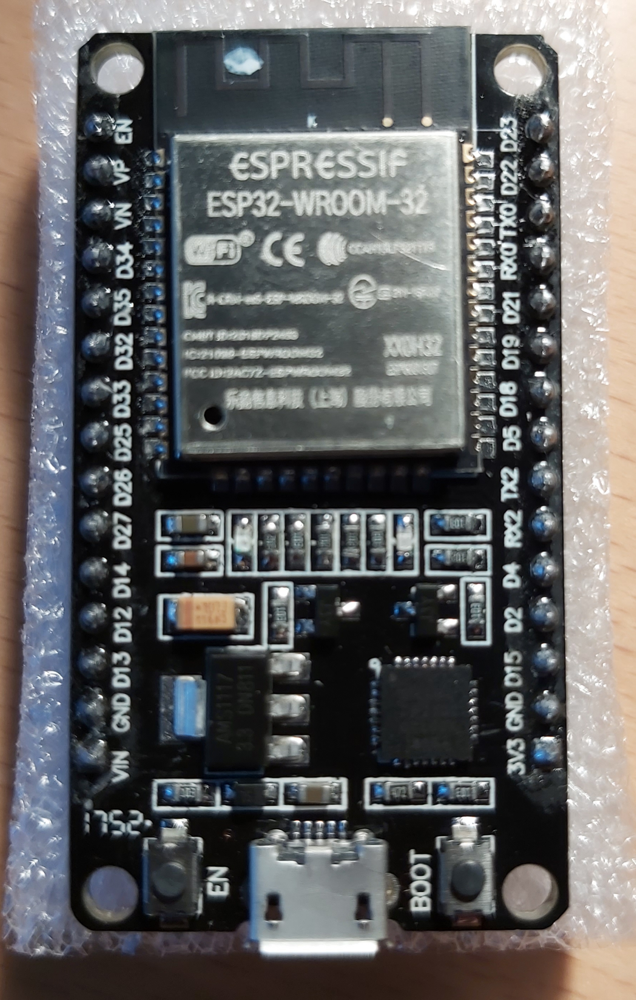

# Peripheral

Simple implementation of a BLE GATT server providing a [Battery Service](https://www.bluetooth.org/docman/handlers/downloaddoc.ashx?doc_id=245138)

# Development tools

* [rshell](https://github.com/dhylands/rshell) to access the _ESP32_ and copy the required files
* [ubluetooth](https://docs.micropython.org/en/latest/library/ubluetooth.html) micropython module
* [mock](#Mock) see below
* [BLE Scanner](https://play.google.com/store/apps/details?id=com.macdom.ble.blescanner), android app to play with BLE

## ESP32 board
SP-Cow ESP32 modulo WiFi Placa de Desarrollo, ESP-WROOM-32 ESP-32 ESP-32S 2.4GHz WiFi + Bluetooth Modo Dual Módulo de Antena con Ultra Low Power (1 Pack)

You can find a board like this [here](https://www.amazon.es/gp/product/B07XH45MWW/ref=ppx_yo_dt_b_asin_title_o07_s00)

Additional information regarding ESP32:

* [micropython quick reference for the ESP32](https://docs.micropython.org/en/latest/esp32/quickref.html)
* [Espressif](https://www.espressif.com/en/support/documents/technical-documents?keys=&field_type_tid%5B%5D=54)

### Flashing micropython to ESP32

See [Getting started with MicroPython on the ESP32](https://docs.micropython.org/en/latest/esp32/tutorial/intro.html) tutorial

# Implemented behaviour

What does this BLE test implementation do? Well, not much. In addition, the behaviour was implemented
following a phased approach:

## Initial implementation

* [x] Register a service for [Battery Service](https://www.bluetooth.org/docman/handlers/downloaddoc.ashx?doc_id=245138)
* [x] Advertise the service, including advertising payload
* [x] Allow a central to connect to the peripheral and read the value
* [x] Allow reading and writing the battery level value
* [x] Restart advertising after central disconnected (allow new central connection)

## Improvements (some of them already implemented)

* [x] Allow multiple connections from centrals
* [x] Notify the central(s) when the battery level changes, asynchronously 
* [x] Read the value for the battery level from an ADC connected to a potentiometer
* [ ] Allow feedback on central connections using the on-board blue led (Pin 2)
* [ ] Add descriptors for the characteristics

# Deployment
With the ESP32 board connected to the USB port, run:

        ./deploy.sh
        
This script starts `rshell` in port `/dev/ttyUSB0` and runs the `rshell` commands file
`rshell_deploy`, which in turn copies all the files in `py` folder **except** those starting
with `test_`

# Interesting pointers

* Regarding TDD & micropython:
  - [ESP32 Machine emulator](https://github.com/tflander/esp32-machine-emulator#esp32-machine-emulator), not very mature project yet, but promising 
  - [micropython unix porting](https://github.com/micropython/micropython#the-unix-version), also available on _Ubuntu_ as `snap install micropython`; _ubluetooth_ module not available

* Regarding BLE details and codes:
  - [ubluetooth package](https://docs.micropython.org/en/latest/library/ubluetooth.html?highlight=ubluetooth#module-ubluetooth)
  - [micropython examples repository: bluetooth](https://github.com/micropython/micropython/tree/master/examples/bluetooth)
  - [GAP appearance](https://www.bluetooth.com/xml-viewer/?src=https://www.bluetooth.com/wp-content/uploads/Sitecore-Media-Library/Gatt/Xml/Characteristics/org.bluetooth.characteristic.gap.appearance.xml), generic codes for peripheral appearance
  - [uPyM5BLE](https://github.com/lemariva/uPyM5BLE), a more complete project (worth taking a look)
 
* Regarding ADC details in ESP32:
  - [Quick Reference for the ESP32: ADC](https://docs.micropython.org/en/latest/esp32/quickref.html#adc-analog-to-digital-conversion)
  - [micropython machine.ADC](https://docs.micropython.org/en/latest/library/machine.ADC.html)

# Mock

As part of this project, a simple module to create mocks and ease TDD-ing the development of the main module has been developed

## Philosophy

The idea is inspired by the popular `mockito` library, available in `Java`. It should run using only the available functionality of the port of `micropython` to unix systems and the [`micropython-lib`](https://github.com/micropython/micropython-lib) available libraries. The library is intended to be used only on this interpreter while doing development on a linux box and **not on a real device**

### Why not to use `unittest.mock` package?

Good question! The problem is that the requirements for running `unittest.mock` on `micropython` seemed a little bit too-much to me. So, I decided to build something simpler, but powerful enough to allow for TDD-ing a development on `micropython`

## Use cases / requirements

* Create a mock object from a real `micropython` class:

		from mock import Mock, create_mock
		from bluetooth import BLE
		mockBLE = create_mock(BLE)
		assert isinstance(mockBLE, Mock)
		assert not isinstance(mockBLE, BLE)

* Set expected values to return on calls:

		mockBLE.when('active', return_value = True) # return True on mockBLE.active()

* Set expected values to return depending on arguments:

		mockBLE.when('active', (True,), return_value = True) # return True on mockBLE.active(True)
		mockBLE.when('active', return_value = False) # else, return False

* Set expectations on invocations on the mock:

		assert mockBLE.hasBeenCalled()
		assert mockBLE.hasBeenCalled(times = 3) # three times
		assert mockBLE.hasBeenCalled(method = 'active', times = 2) # BLE.active has been called twice
		assert mockBLE.hasBeenCalledWith(method = 'active', args) # BLE.active has been called with these parameters
		assert mockBLE.hasBeenCalledWith(method = 'active', args, times=2) # BLE.active has been called with these parameters, twice

* Mock reset:
		from mock import createMockFor
		from bluetooth import BLE
		mockBLE = createMockFor(BLE)
		mockBLE.active()
		assert mockBLE.hasBeenCalled()
		assert mockBLE.hasBeenCalledWith(method = 'active', (), times = 1)		
		mockBLE.reset()
		assert not mockBLE.hasBeenCalled()

* Set expectations on raising exceptions:
		mockBLE.when('active', (True,), raise=OSError) # raise OSError on mockBLE.active(True)

* [OPTIONAL] Set assertions on order of calls on the mock

## Installing and using

Just copy the `mock` module to your `micropython` linux installation.

For instance, if `micropython` looks for installed modules and libraries in:

        ~/.micropython/lib
        
copy the `mock` folder in this project to that location.

Once available to `micropython`'s linux port, the module can be used **in tests** as:

        from mock import create_mock, Mock
        

